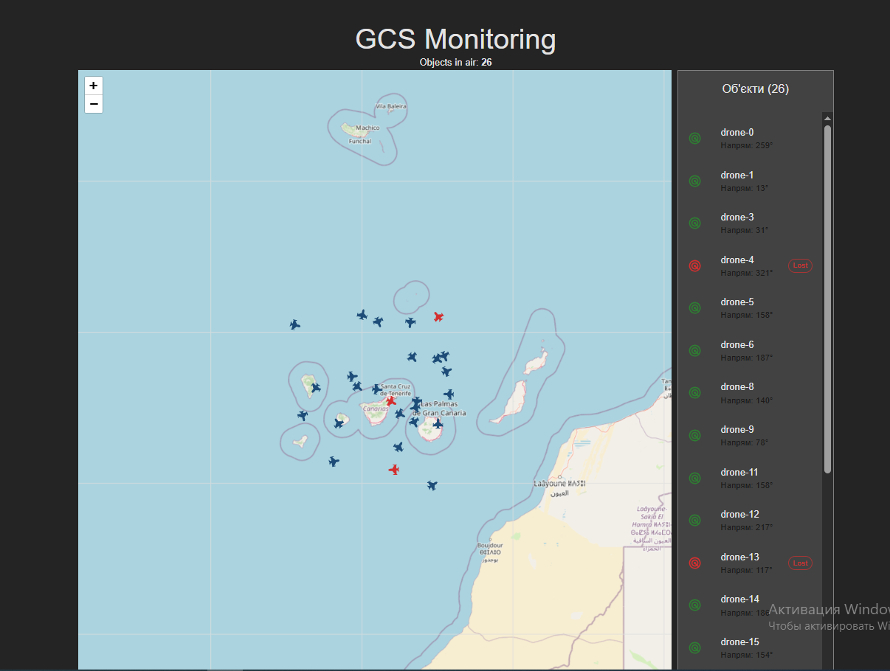

# Real-time Drone Tracker (GCS Simulation)

Це тестове завдання, в якому я реалізував систему моніторингу безпілотних об'єктів у реальному часі. Основний фокус був
на роботі з великим потоком даних через WebSockets та управлінні станом за допомогою MobX.


---




## Основний функціонал

- **Real-time Map:** Візуалізація 150+ дронів одночасно. Об'єкти плавно рухаються завдяки CSS-інтерполяції координат.
- **WebSocket Integration:** Дані летять з Mock-сервера, імітуючи реальну телеметрію.
- **MobX RootStore Pattern:** Масштабована архітектура сторів (MainStore + AuthStore).
- **"Dead Man's Switch" Logic:** Система автоматично позначає дрон як "Lost", якщо телеметрія не оновлюється більше 10
  секунд, і видаляє його через 5 хвилин тиші.
- **Smart UI:** Пошук по ID об'єкта та миттєвий "jump-to" (центрування карти) при кліку на дрон у списку.
- **Authorization:** Доступ до панелі лише за унікальним ключем.

---

## Стек технологій

| Frontend            | Backend (Mock)      | Спеціальні інструменти      |
|:--------------------|:--------------------|:----------------------------|
| **React 18** (Vite) | **Node.js**         | **Leaflet** (Map Engine)    |
| **TypeScript**      | **WS** (WebSockets) | **MobX** (State Management) |
| **Material UI**     |                     | **Lucide Icons**            |

---

## Як запустити проект

Проект складається з клієнтської та серверної частин. Для коректної роботи потрібно запустити обидві.

### 1. Клонування репозиторію
```bash 
git clone [https://github.com/for-lite-page/realtime-tracker.git](https://github.com/for-lite-page/realtime-tracker.git)
cd realtime-tracker
```

### 2. Запуск Mock-сервера (Terminal 1)
```bash
    cd server
    npm install
    node server.js
```

### 3. Запуск Frontend (Terminal 2)
```bash
npm install
npm run dev
```

### 🔑 Ключ для входу: 
```
testSecret
```